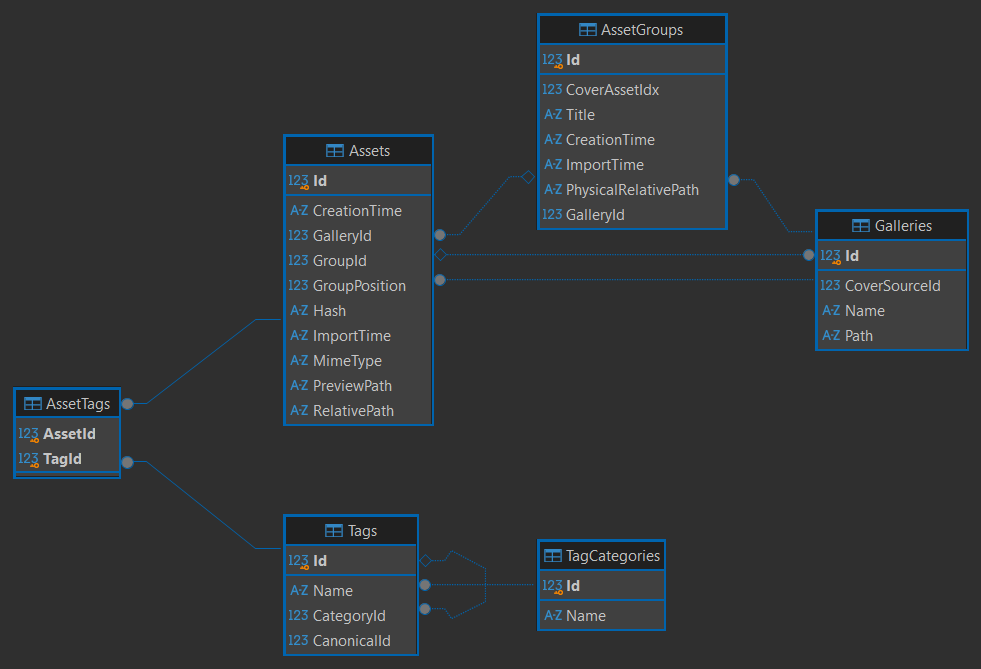

# GalleryViewer

A local media gallery and management application for browsing, organizing, and searching image and video collections.

The backend provides a REST API for managing galleries, media assets, metadata, and tags, while handling media processing and preview generation. A dedicated synchronization tool keeps the database in sync with existing files on disk.

## Features

- Gallery and media asset management
- Image and video browsing with generated previews
- Image tagging — create tags, assign tags to assets, and search by tags
- Synchronization of the database with existing media files
- Automatic image and video preview generation

## Technologies

- **.NET 10**
- **ASP.NET Core**
- **Entity Framework Core**
- **SQLite**
- **SixLabors.ImageSharp** — image processing and preview generation
- **FFMpegCore** — video processing for preview generation
- **Spectre.Console** — CLI tools and terminal UI
- **REST API**
- **Swagger** — OpenAPI contract generation

## REST API

The backend exposes a RESTful HTTP API for working with galleries, media assets, tags, and media resources.

The API is described using an **OpenAPI contract**, which is used by the separate React/TypeScript frontend to generate strongly typed API clients and TanStack Query hooks with **Orval**.

## Architecture

The application follows a layered architecture:

```text
┌─────────────────────┐
│         API         │
│ HTTP / Controllers  │
└──────────┬──────────┘
           │
┌──────────▼──────────┐
│    Application      │
│   Use cases / Logic │
└──────────┬──────────┘
           │
┌──────────▼──────────┐
│        Data         │
│ Persistence / EF    │
└─────────────────────┘
```

Business logic and use cases are handled by the Application layer, while the Data layer is responsible for persistence and infrastructure concerns.

This keeps HTTP concerns isolated in the API layer and avoids coupling application logic directly to controllers or persistence details.

Media storage is accessed through an abstraction layer, with the current
implementation using the local filesystem. This keeps storage concerns
separate from application logic and allows alternative storage providers
to be introduced in the future.

## Getting Started

### Prerequisites

- **.NET 10 SDK**
- **Entity Framework Core CLI tools**
  
### Configuration

Configure the application settings in `appsettings.json` for both the **GalleryViewer** and **Tools** projects.

Example:

```json
{
  "PreviewSettings": {
    ...
    "PreviewFolder": "<path to previews directory>"
  },
  "ConnectionStrings": {
    "GalleryViewer": "Data Source=<path to SQLite database>"
  }
}
```

`PreviewSettings` controls the generated image preview dimensions, quality, and storage location.

### Database Setup

Apply the Entity Framework Core migrations to create and update the SQLite database:

`dotnet ef database update`

Run the command from the GalleryViewer project directory.

### Running the API

From the `GalleryViewer` project:

```bash
dotnet run
```

The API will be available at: `https://localhost:7043`

For a production build, the repository also includes:

```powershell
.\publish.ps1
```

which publishes the application for deployment.

## Synchronization Tool

The **Tools** project provides a command-line utility for synchronizing the database with existing files on disk.

The `sync` (`s`) command accepts a JSON configuration file describing the galleries to synchronize:

```bash
dotnet run --project Tools --sync <path-to-config.json>
OR 
Tools.exe --sync <path-to-config.json> (in production build)
```

Example configuration:

```json
{
  "Galeries": [
    {
      "Name": "<gallery name>",
      "Path": "<path to image gallery>",
      "ThumbnailFile": "<file>" // optional
    }
  ]
}
```

The synchronization process scans the configured directories and updates the database to reflect the existing media files.

## Frontend

Frontend repository:

**https://github.com/Vlad311010/GalleryViewer-Frontend.git**

The frontend is maintained as a separate project and consumes the GalleryViewer REST API through the generated OpenAPI client.


## Database schema



